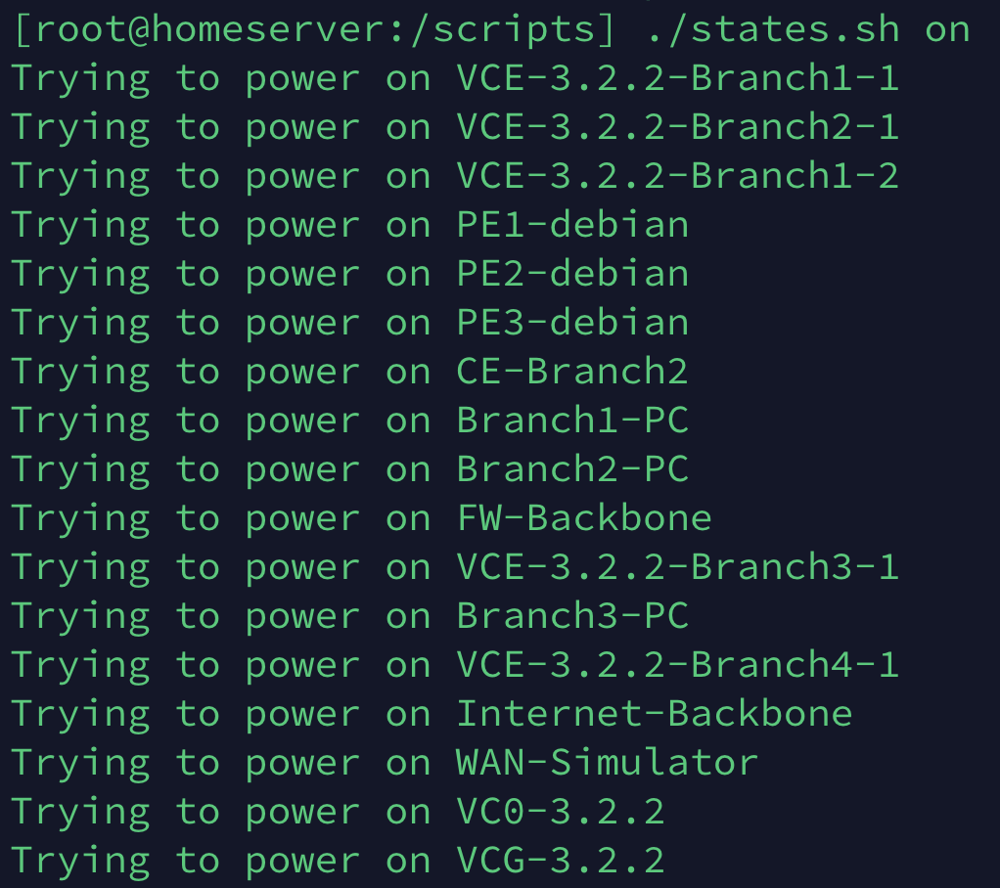
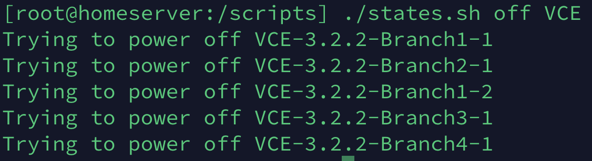

# ESXi VM Booting
> Start or Shutdown Multiple VMs on ESXi Host at Once 

The idea, an easy straightfoward way to start or shutdown multiple VMs on a ESXi host.
One can say to switch on or off all VMs, or just some VMs based on the partial string in the name of the VM. 




It is a very simple shell script but can be extended and improved.

## Installation

Windoes/OS X & Linux:

```sh
git clone https://github.com/iddocohen/esxi-boot-vm
scp states.sh root@<IP of ESXi Host>:/<any directory you like>/
```

## Help

```sh
[root@homeserver:/scripts] ./states.sh 
Usage: ./states.sh [on]/[off] ([array of VM names]).
e.g.: ./states.sh on PE1 PE2 or ./states.sh off

```

## Useage Example

The script takes the first parameter to be the state you wish and an array of VM Names you want to change the state to.

Note: It will ignoore the vCenter VM if hosted on the ESXi. 

```sh
[root@homeserver:/scripts] ./states.sh on  
Usage: ./states.sh [on]/[off] ([array of VM names]).
e.g.: ./states.sh on PE1 PE2 or ./states.sh off

```

## Release History

* 0.0.1
    * First versions

## Future improvements

* Better print out
* Better mechansim to filter out vCenter VM 
* Loop optimization
* (maybe) Create it API based, to make sure

## Contributing

1. Fork it (<https://github.com/iddocohen/esxi-vm-boot/fork>)
2. Create your feature branch (`git checkout -b feature/fooBar`)
3. Commit your changes (`git commit -am 'Add some fooBar'`)
4. Push to the branch (`git push origin feature/fooBar`)
5. Create a new Pull Request

<!-- Markdown link & img dfn's -->
[wiki]: https://github.com/iddocohen/esx-vm-boot/wiki
